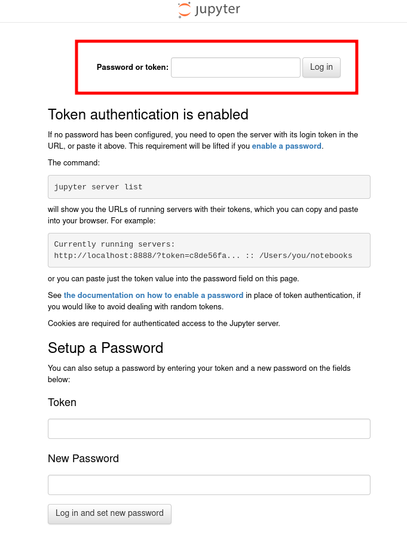

Docker file for doing a minimal tutorial on single cell analysis.

## version 0.1

The packages explicitly installed in this image are:

> scanpy==1.7.0\
> matplotlib==3.3.4\
> numpy==1.20.1\
> scipy==1.6.0\
> pandas==1.2.2\
> seaborn==0.11.1\
> scrublet==0.2.3\
> xlsxwriter==1.4.4\
> leidenalg==0.8.7\
> networkx==2.5

## 1. Building the docker
A docker image with the required python version and packages can be created running

```
./build.sh
```

It has been very useful the information from the blog: [https://www.docker.com/blog/multi-platform-docker-builds/](https://www.docker.com/blog/multi-platform-docker-builds/)

## 2. Running the docker
For running the docker and go over the analysis steps in a jupyter lab session, just run,

```
./run.sh
```

Once run, the docker will be working and executing in the channel 10000. Change the channel in the `run` script if you want to run it in some other channel.. In the terminal you will find a token code that is generated for security reasons:


Copy that number. For accessing the session, open your favorite folder brwoser and search `localhost:10000`. Directly from the terminal it will be something like,

```
firefox localhost::10000
```

it will open a jupyterlab session that will ask for a password or token.  



Copy the token you obtained before and you will be set up! 

Anything in the `home` folder can be seen by the docker and you and will be saved after the docker is finished.


